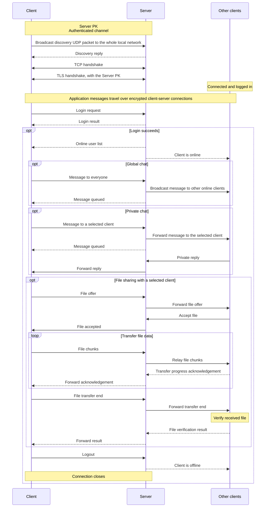

# Client and server interaction

```mermaid
sequenceDiagram
    participant C as Client
    participant S as Server
    participant O as Other clients

    Note over C,S: Server PK<br/>Authenticated channel

    C->>S: Broadcast discovery UDP packet to the whole local network
    S-->>C: Discovery reply
    C<<->>S: TCP handshake
    C<<->>S: TLS handshake, with the Server PK

    Note over O: Connected and logged in
    Note over C,O: Application messages travel over encrypted client-server connections

    C->>S: Login request
    S-->>C: Login result

    opt Login succeeds
        S-->>C: Online user list
        S-->>O: Client is online

        opt Global chat
            C->>S: Message to everyone
            S->>O: Broadcast message to other online clients
            S-->>C: Message queued
        end

        opt Private chat
            C->>S: Message to a selected client
            S->>O: Forward message to the selected client
            S-->>C: Message queued
            O->>S: Private reply
            S->>C: Forward reply
        end

        opt File sharing with a selected client
            C->>S: File offer
            S->>O: Forward file offer
            O->>S: Accept file
            S->>C: File accepted
            loop Transfer file data
                C->>S: File chunks
                S->>O: Relay file chunks
                O-->>S: Transfer progress acknowledgement
                S-->>C: Forward acknowledgement
            end
            C->>S: File transfer end
            S->>O: Forward transfer end
            Note over O: Verify received file
            O-->>S: File verification result
            S-->>C: Forward result
        end

        C->>S: Logout
        S-->>O: Client is offline
        Note over C,S: Connection closes
    end
```
